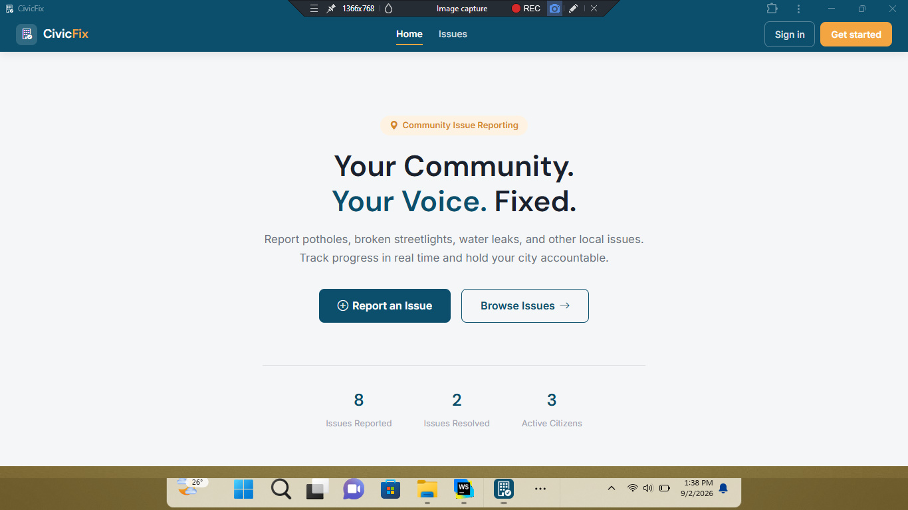
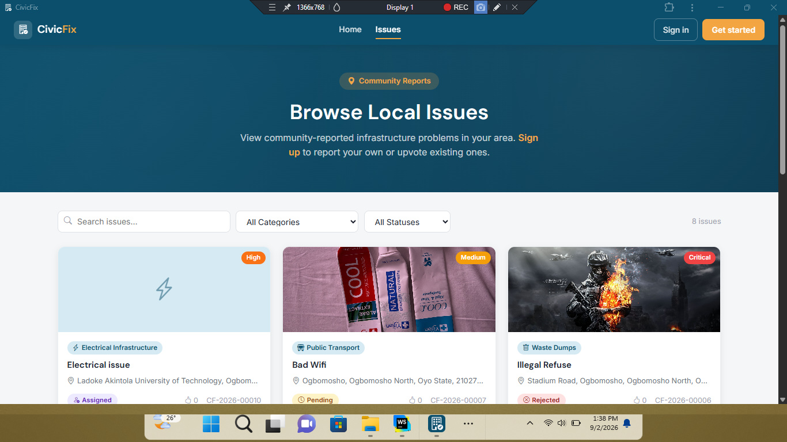
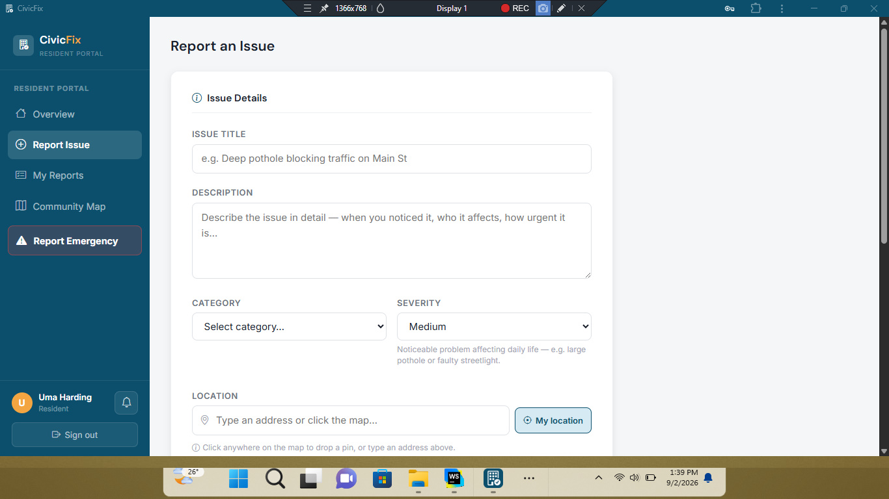
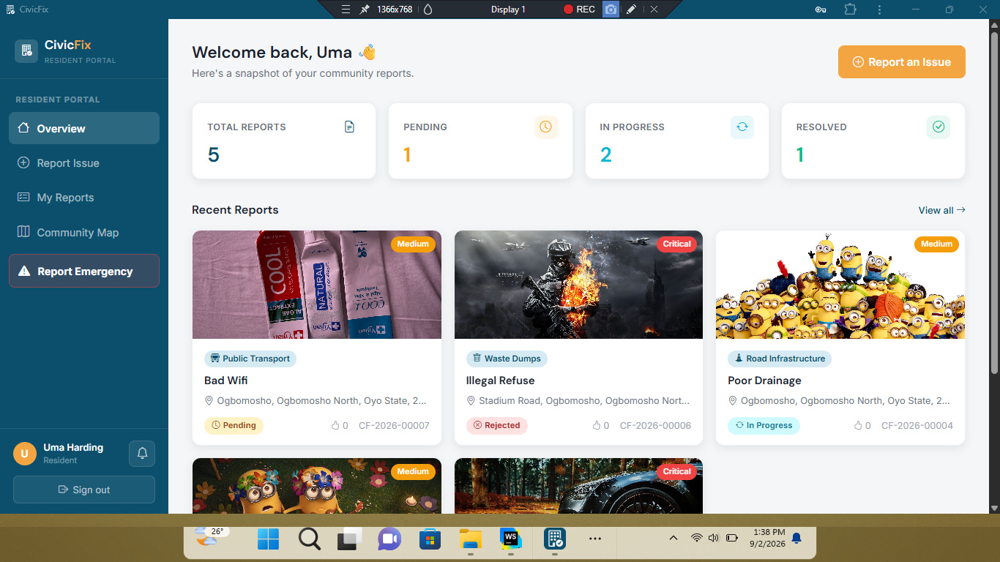
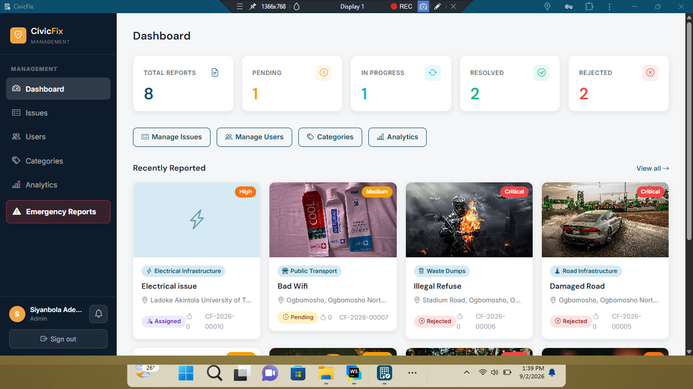
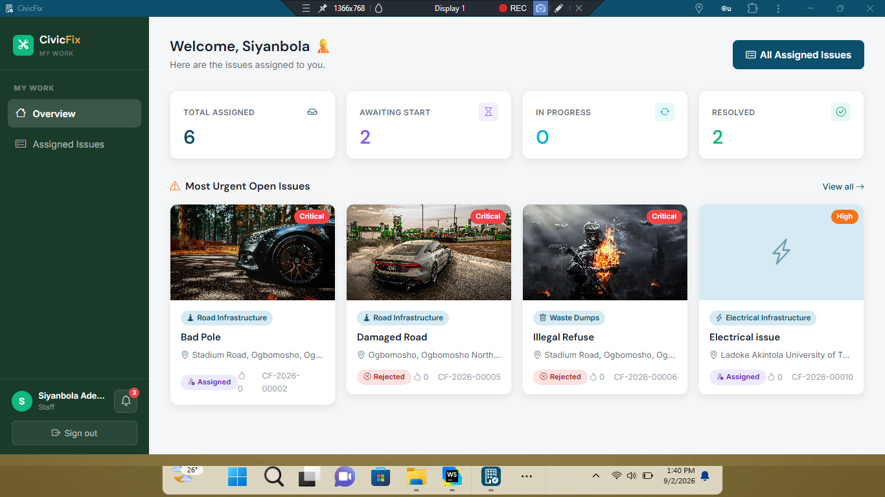
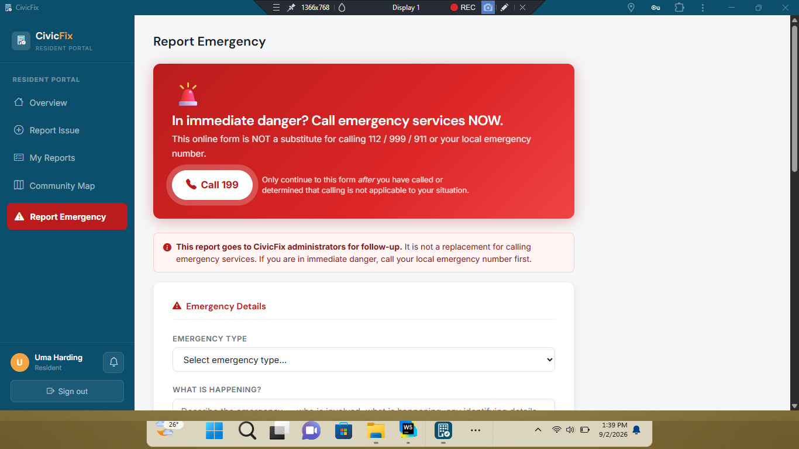

# 🏘️ CivicFix Frontend

### Smart Community Problem/Issue & Emergency Reporting and Resolution Platform

CivicFix is a web-based platform that enables residents to report community problems and monitor their progress toward resolution.

The frontend provides an intuitive interface for **Residents, Staff, and Administrators**, connecting to the CivicFix REST API to manage reports, users, notifications, and issue-resolution workflows.

🌐 **Live Application:** [Visit CivicFix](https://sjr-civicfix.vercel.app/)

💻 **Backend Repository:** [CivicFix Backend](https://github.com/ShimboJr/CivicFix-Backend)

---

## ✨ Features

### 👤 Residents

- Register and log in securely
- Report community problems
- Upload images and provide issue locations
- Browse and search community issues
- Filter issues by category and status
- Upvote issues affecting their community
- Comment on reported issues
- Track submitted reports
- Receive notifications
- Submit private emergency reports

### 👨‍💼 Administrators

- View and manage reported issues
- Assign issues to staff members
- Manage users and roles
- Manage issue categories
- Monitor staff workload
- View platform statistics and analytics
- Manage emergency reports
- Perform bulk issue operations

### 🧑‍🔧 Staff

- View assigned issues
- Update issue progress
- Manage assigned reports
- Upload resolution evidence
- Mark issues as resolved

---

## 📸 Application Screenshots

### 🏠 Homepage



### 🌍 Community Issues



### 📝 Report an Issue



### 👤 Resident Dashboard



### 👨‍💼 Administrator Dashboard



### 🧑‍🔧 Staff Dashboard



### 🚨 Emergency Reporting



---

## 🛠️ Technology Stack

- HTML5
- CSS3
- JavaScript
- Bootstrap
- Font Awesome
- Vite
- REST API
- JWT Authentication

> Update this list if your final frontend implementation uses additional technologies.

---

## 🔌 Backend API Integration

The CivicFix frontend communicates with the CivicFix REST API for authentication, issue management, user management, notifications, emergency reporting, and other application functionality.

**Backend Repository:**  
[CivicFix Backend](https://github.com/ShimboJr/CivicFix-Backend)

**API Documentation:**  
[View API Documentation](https://github.com/ShimboJr/CivicFix-Backend/blob/main/docs/API_DOCUMENTATION.md)

---

## ⚙️ Installation

### 1. Clone the Repository

```bash
git clone https://github.com/ShimboJr/CivicFix-Frontend
```

### 2. Navigate to the Project

```bash
cd CivicFix-Frontend
```

### 3. Install Dependencies

```bash
npm install
```

### 4. Configure Environment Variables

Create a `.env` file in the project root and add the API URL required by the application.

Example:

```env
VITE_API_URL=https://civicfix-backend.vercel.app/api
```

> Use the exact environment variable name and backend URL configured in your frontend project.

### 5. Start the Development Server

```bash
npm run dev
```

The application will normally be available at the local URL provided by Vite.

---

## 🚀 Deployment

The CivicFix frontend is deployed using Vercel.

🌐 **Live Application:** [Visit CivicFix](https://sjr-civicfix.vercel.app/)

For production deployment, configure the required environment variables in your Vercel project settings before deploying the application.

---

## 🎯 Project Objectives

CivicFix was developed to:

- Make community problem reporting easier and more accessible.
- Improve communication between residents and responsible personnel.
- Provide transparency throughout the issue-resolution process.
- Allow residents to track the progress of their reports.
- Encourage community participation in identifying local problems.

---

## 🔮 Future Improvements

Potential future enhancements include:

- Real-time issue updates
- Interactive geographical maps
- AI-assisted issue categorization
- Advanced duplicate issue detection
- Native mobile applications
- Government and emergency service integrations
- SMS notifications
- Multi-language support

---

## 👨‍💻 Author

**Siyanbola Adeola Olaoluwa**

Developed as a **Level 3 Web Development Completion Project**.

---

## 📄 License

This project is currently intended for **educational and portfolio purposes**.

---

⭐ If you find this project interesting, consider giving the repository a star!
