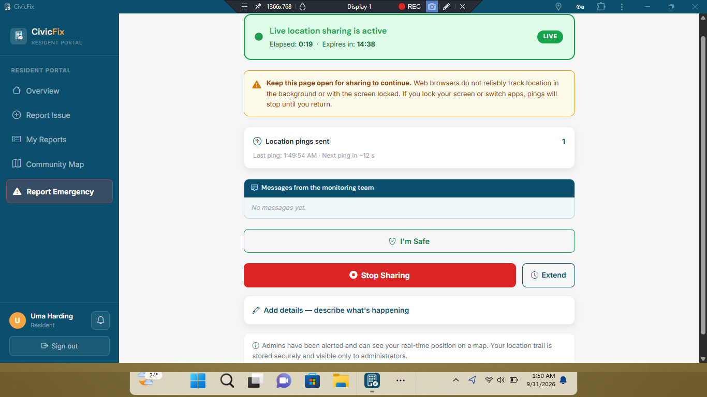

# 🏘️ CivicFix Frontend

### Smart Community Problem/Issue & Emergency Reporting and Resolution Platform

CivicFix is a web-based platform that enables residents to report community problems and monitor their progress toward resolution.

The frontend provides an intuitive interface for **Residents, Staff, and Administrators**, connecting to the CivicFix REST API to manage reports, users, notifications, and issue-resolution workflows.

🌐 **Live Application:** [Visit CivicFix](https://sjr-civicfix.vercel.app/)

💻 **Backend Repository:** [CivicFix Backend](https://github.com/ShimboJr/CivicFix-Backend)

---

## ✨ Features

### 👤 Residents

- Register and log in securely
- Report community problems
- Upload images and provide issue locations
- Browse and search community issues
- Filter issues by category and status
- Upvote issues affecting their community
- Comment on reported issues
- Track submitted reports
- Receive notifications
- Submit private emergency reports
- Activate live location sharing during personal-safety emergencies
- Share real-time location updates with authorized administrators
- View live location session status and movement history
- Send an “I'm Safe” confirmation without automatically ending location tracking

### 👨‍💼 Administrators

- View and manage reported issues
- Assign issues to staff members
- Manage users and roles
- Manage issue categories
- Monitor staff workload
- View platform statistics and analytics
- Manage emergency reports
- Perform bulk issue operations

### 🧑‍🔧 Staff

- View assigned issues
- Update issue progress
- Manage assigned reports
- Upload resolution evidence
- Mark issues as resolved

---

## 📸 Application Screenshots

### 🏠 Homepage


### 🌍 Community Issues


### 📝 Report an Issue


### 👤 Resident Dashboard


### 👨‍💼 Administrator Dashboard


### 🧑‍🔧 Staff Dashboard


### 🚨 Emergency Reporting


### 📍 Live Location Sharing

During a personal-safety emergency, residents can activate live location sharing so authorized administrators can monitor their current location and movement history.



---

## 📍 Live Location Sharing

CivicFix includes a dedicated live location sharing feature for personal-safety emergencies. It allows a resident to share their current GPS position with authorized administrators while the session remains active.

### How It Works

1. **Activate Live Location Sharing** — The resident starts a live location session and provides their initial GPS coordinates.
2. **Private Emergency Report** — CivicFix automatically creates a private **Live Location SOS** emergency report linked to the session.
3. **Administrator Alert** — Authorized administrators are notified through the existing emergency notification workflow.
4. **Location Updates** — The resident's device periodically sends location pings containing latitude, longitude, and optional accuracy information.
5. **Movement History** — Location updates are retained as a location trail so administrators can review the resident's movement history.
6. **Session Expiry or End** — A session can expire automatically based on its configured duration or be explicitly ended.
7. **Administrator Messages** — Administrators can send messages to the resident during a session. These messages are retrieved by the resident client rather than sent as push/system notifications.
8. **“I'm Safe” Confirmation** — The resident can confirm that they are safe. This records the confirmation and notifies administrators, but **does not automatically stop location tracking**.

### Privacy and Access

Live location data is handled as private emergency information. The frontend uses the backend API's role and ownership controls so that live location sessions and session messages are only available to authorized users.

For the complete endpoint definitions, request/response formats, permissions, and data models, see the [CivicFix API Documentation](https://github.com/ShimboJr/CivicFix-Backend/blob/main/docs/API_DOCUMENTATION.md).

---

## 🛠️ Technology Stack

- HTML5
- CSS3
- JavaScript
- Bootstrap
- Font Awesome
- Vite
- REST API
- JWT Authentication

---

## 🔌 Backend API Integration

The CivicFix frontend communicates with the CivicFix REST API for authentication, issue management, user management, notifications, emergency reporting, live location sharing, and other application functionality.

**Backend Repository:**  
[CivicFix Backend](https://github.com/ShimboJr/CivicFix-Backend)

**API Documentation:**  
[View API Documentation](https://github.com/ShimboJr/CivicFix-Backend/blob/main/docs/API_DOCUMENTATION.md)

---

## ⚙️ Installation

### 1. Clone the Repository

```bash
git clone https://github.com/ShimboJr/CivicFix-Frontend.git
```

### 2. Navigate to the Project

```bash
cd CivicFix-Frontend
```

### 3. Install Dependencies

```bash
npm install
```

### 4. Configure Environment Variables

Create a `.env` file in the project root and add the API URL required by the application.

Example:

```env
VITE_API_URL=https://civicfix-backend.vercel.app/api
```

### 5. Start the Development Server

```bash
npm run dev
```

The application will normally be available at the local URL provided by Vite.

---

## 🚀 Deployment

The CivicFix frontend is deployed using Vercel.

🌐 **Live Application:** [Visit CivicFix](https://sjr-civicfix.vercel.app/)

For production deployment, configure the required environment variables in your Vercel project settings before deploying the application.

---

## 🎯 Project Objectives

CivicFix was developed to:

- Make community problem reporting easier and more accessible.
- Improve communication between residents and responsible personnel.
- Provide transparency throughout the issue-resolution process.
- Allow residents to track the progress of their reports.
- Encourage community participation in identifying local problems.
- Provide a private personal-safety mechanism through live location sharing.

---

## 🔮 Future Improvements

Potential future enhancements include:

- Real-time issue updates
- More advanced real-time geographical map experiences
- AI-assisted issue categorization
- Advanced duplicate issue detection
- Deeper background location support through native mobile applications
- Government and emergency service integrations
- SMS notifications
- Multi-language support

---

## 👨‍💻 Author

**Siyanbola Adeola Olaoluwa**

Developed as a **Level 3 Web Development Completion Project**.

---

## 📄 License

This project is currently intended for **educational and portfolio purposes**.

---

⭐ If you find this project interesting, consider giving the repository a star!
